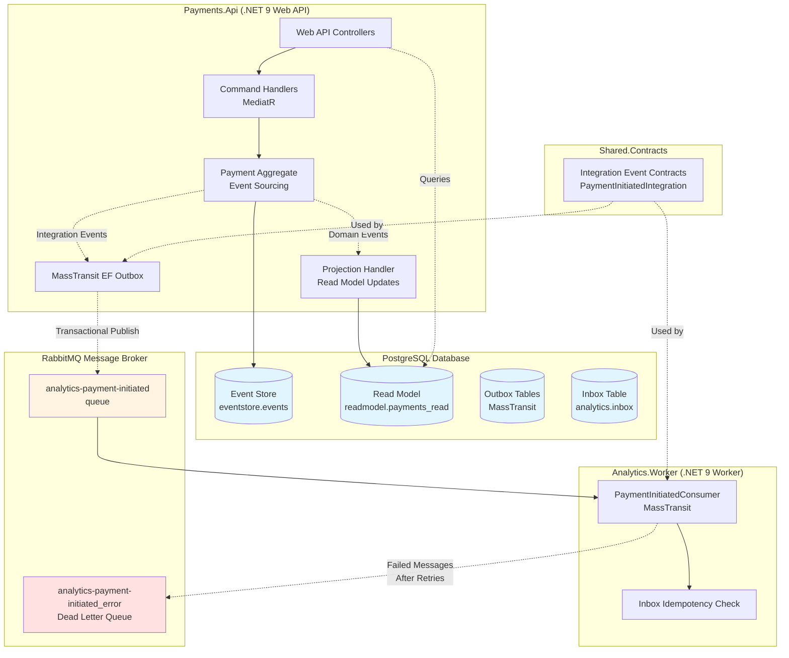

# Architecture Overview

This document provides a container-level architecture view of the event-driven financial system and explains the key architectural patterns in use.

## System Architecture Diagram

## Key Architectural Patterns

### Event Sourcing

The system uses **Event Sourcing** to persist domain state as a sequence of immutable domain events rather than storing current state directly.

- **Event Store**: The `eventstore.events` table in PostgreSQL stores all domain events in append-only fashion
- **Aggregate Reconstruction**: The `PaymentAggregate` is rehydrated by replaying all historical events
- **Auditability**: Complete audit trail of all changes to payment entities
- **Time Travel**: Ability to reconstruct state at any point in time

**Implementation**: Domain events like `PaymentInitiated` are stored in the event store and replayed to rebuild aggregate state.

### CQRS (Command Query Responsibility Segregation)

The system separates **write** operations (commands) from **read** operations (queries).

- **Command Side**: 
  - Commands are handled via **MediatR** command handlers
  - Aggregates process commands and emit domain events
  - Events are persisted to the event store
  
- **Query Side**:
  - Separate read model (`readmodel.payments_read`) optimized for queries
  - Read model is eventually consistent with the write model
  - API queries read from the optimized read model, not from the event store

**Benefits**: Independent scaling of reads and writes, optimized query performance, flexibility in read model structure.

### Projections / Read Model

**Projections** transform domain events from the event store into denormalized, query-optimized read models.

- **Read Model Table**: `readmodel.payments_read` contains materialized payment state
- **Projection Handlers**: Listen to domain events and update the read model accordingly
- **Eventually Consistent**: Read model may lag slightly behind the write model
- **Query Optimization**: Read model is denormalized and indexed for fast queries

**Flow**: Domain Event → Projection Handler → Read Model Update

### Transactional Outbox Pattern

The **Outbox Pattern** ensures reliable message publishing by storing outbound messages in the database as part of the same transaction that processes the command.

- **MassTransit EF Outbox**: Integration events are written to outbox tables in the same transaction as domain events
- **Atomic Operation**: Database update + message enqueue happen atomically
- **Guaranteed Delivery**: Outbox processor polls and publishes messages to RabbitMQ
- **No Dual-Write Problem**: Prevents inconsistencies between database and message broker

**Configuration**: Enabled via `UseBusOutbox()` in `Payments.Api/Program.cs`.

### Inbox Idempotency

The **Inbox Pattern** in the Analytics Worker ensures that messages are processed **exactly once**, even if they are delivered multiple times.

- **Inbox Table**: `analytics.inbox` stores processed message IDs
- **Duplicate Detection**: Before processing, consumer checks if MessageId already exists
- **Idempotent Handling**: Duplicate messages are safely ignored
- **At-Least-Once Delivery**: Works with RabbitMQ's at-least-once delivery guarantee

**Implementation**: `PaymentInitiatedConsumer` checks inbox before processing each message.

### Retries and Dead Letter Queue (DLQ)

The system implements **automatic retries** with exponential backoff and a **Dead Letter Queue** for failed messages.

- **Retry Policy**: Configured in MassTransit with intervals (200ms, 1s, 5s)
- **Automatic Retries**: Failed messages are retried according to the policy
- **Dead Letter Queue**: After all retries are exhausted, messages move to `analytics-payment-initiated_error` queue
- **Manual Inspection**: Failed messages in DLQ can be inspected via RabbitMQ Management UI (http://localhost:15672)
- **Replay Capability**: Messages can be manually moved from DLQ back to the main queue

**Configuration**: Retry policy configured in `Analytics.Worker/Program.cs` using `UseMessageRetry()`.

## Component Responsibilities

### Payments.Api
- Exposes REST API for payment operations
- Processes commands via MediatR
- Maintains payment aggregates using event sourcing
- Publishes integration events via outbox
- Serves queries from read model

### Analytics.Worker
- Consumes integration events from RabbitMQ
- Implements inbox pattern for idempotency
- Processes payment analytics
- Uses retry logic with DLQ for fault tolerance

### Shared.Contracts
- Defines integration event contracts
- Shared between Payments.Api and Analytics.Worker
- Ensures type safety across service boundaries

### PostgreSQL
- Stores event-sourced domain events (`eventstore.events`)
- Maintains query-optimized read model (`readmodel.payments_read`)
- Manages outbox tables for reliable message publishing
- Tracks processed messages in inbox table (`analytics.inbox`)

### RabbitMQ
- Message broker for asynchronous communication
- Routes integration events between services
- Provides retry and DLQ capabilities
- Managed by MassTransit

## Data Flow Example

1. **Client** sends POST request to `/payments/initiate`
2. **API Controller** dispatches `InitiatePaymentCommand` via MediatR
3. **Command Handler** loads/creates `PaymentAggregate`
4. **Aggregate** emits `PaymentInitiated` domain event
5. **Repository** persists event to `eventstore.events` and integration event to **Outbox** (same transaction)
6. **Projection Handler** updates `readmodel.payments_read`
7. **Outbox Processor** publishes `PaymentInitiatedIntegration` to RabbitMQ
8. **RabbitMQ** delivers message to `analytics-payment-initiated` queue
9. **Analytics.Worker** consumes message
10. **Consumer** checks `analytics.inbox` for duplicates
11. **Consumer** processes analytics and saves MessageId to inbox
12. If processing fails, message is retried; if all retries fail, moved to DLQ

## Technology Stack

- **.NET 9**: Web API and Worker hosting
- **MediatR**: CQRS command/query dispatch
- **MassTransit**: Message bus abstraction and patterns (Outbox, Inbox, Retries)
- **Entity Framework Core**: ORM and database migrations
- **PostgreSQL**: Event store and read model persistence
- **RabbitMQ**: Message broker
- **Npgsql**: PostgreSQL driver for .NET

## Running the System

Refer to the [README](../README.md) for instructions on:
- Starting infrastructure (Docker Compose)
- Running database migrations
- Starting the API and Worker
- Testing the system with sample requests
